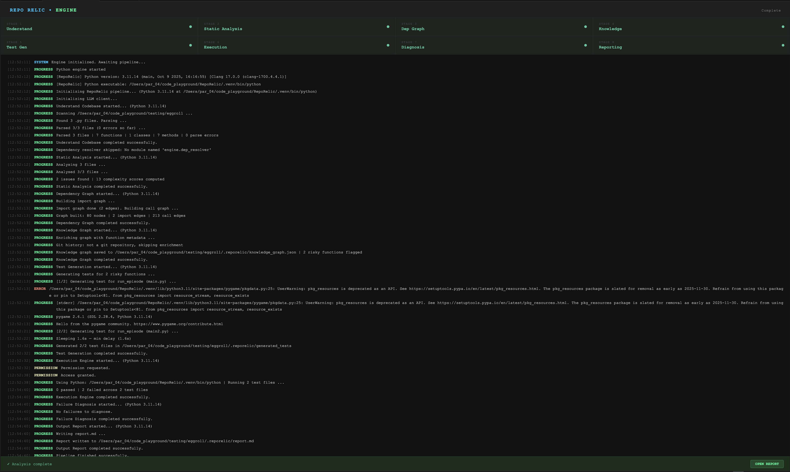
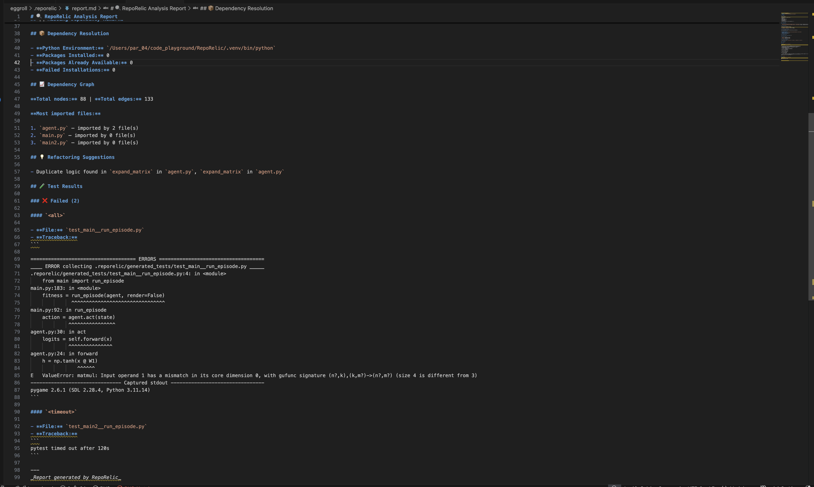
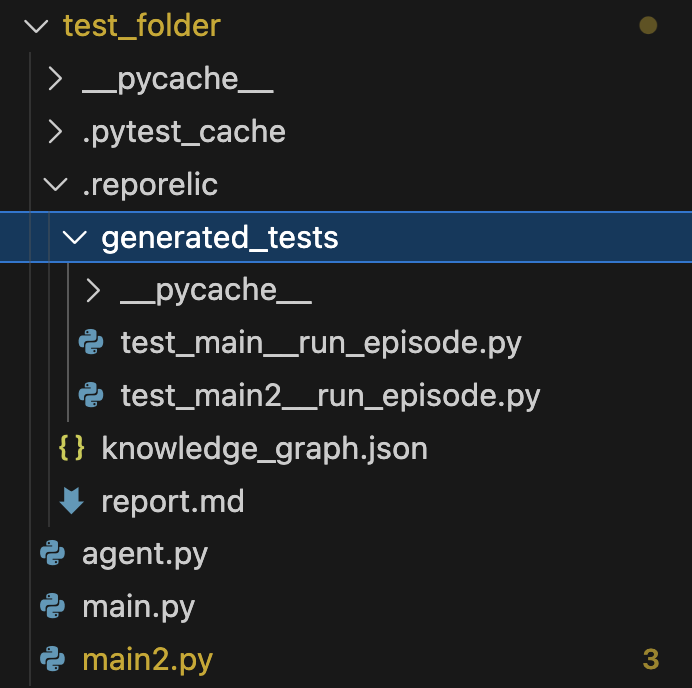

---

# 🏗 Architecture

```text
VS Code Extension (TypeScript)
        ↓
Python Analysis Engine
        ↓
8-Stage Autonomous Pipeline
        ↓
LLM Integration Layer
        ↓
Generated Tests + Diagnostics + Reports
```

RepoRelic combines a TypeScript VS Code extension with a Python-powered analysis engine to perform deep autonomous repository analysis.

---

# ⚡ Analysis Pipeline

```text
Understand Codebase
        ↓
Static Analysis
        ↓
Dependency Graph
        ↓
Knowledge Graph
        ↓
Test Generation
        ↓
Execution Engine
        ↓
Failure Diagnosis
        ↓
Output Report
```

Each stage enriches repository understanding and feeds structured intelligence into later stages.

---

# 📁 Generated Output Structure

After analysis, RepoRelic creates:

```text
your_project/
├── .reporelic/
│   ├── generated_tests/
│   │   ├── test_example.py
│   │   └── ...
│   │
│   ├── knowledge_graph.json
│   ├── report.md
│   └── diagnostics/
│
├── .pytest_cache/
├── __pycache__/
└── source_files.py
```

---

## 🧪 Generated Tests

The `generated_tests/` directory contains:
- edge-case tests
- boundary-condition tests
- regression tests
- integration-style tests

generated automatically for risky functions detected during analysis.

---

## 🕸 Knowledge Graph

`knowledge_graph.json` stores:
- function relationships
- import graph metadata
- call graph structures
- risk annotations
- architectural insights

---

## 📝 Markdown Report

`report.md` contains:
- static analysis findings
- complexity hotspots
- risky functions
- dependency remarks
- generated tests
- execution summaries
- failure diagnoses
- refactoring suggestions

---

# 📊 Example Report Sections

The generated report includes:

- ⚠ Static analysis findings
- 📈 Complexity hotspots
- 🔴 Risky function rankings
- 🚧 Missing dependency diagnostics
- 🧪 Generated unit tests
- 🐛 Failure explanations
- 💡 Refactoring recommendations
- 🔁 Duplicate logic detection
- 🔗 Dependency insights

---

# 🤖 Supported LLM Providers

## OpenAI-Compatible

RepoRelic supports any OpenAI-compatible endpoint:

- OpenAI
- DeepSeek
- GPT-OSS
- Claude-compatible gateways
- Local inference servers
- Ollama-compatible wrappers

Example custom base URL:

```text
https://api.deepseek.com/v1
```

---

## Gemini

RepoRelic also supports Google's Gemini models.

Get a free Gemini API key:

```text
https://aistudio.google.com
```

---

# 🔒 Security

RepoRelic:
- does NOT automatically execute unknown code without permission
- requests execution approval before running generated tests
- stores API keys locally inside VS Code settings
- keeps repository analysis local except for LLM prompts
- never modifies repository source files automatically

---

# 🚀 Performance Notes

Best performance is achieved with:
- Python 3.11+
- virtual environments (`.venv`)
- repositories under ~5k Python files
- modern LLM models

Recommended:
- Apple Silicon / modern CPUs
- SSD storage
- isolated Python environments

---

# 🛠 Troubleshooting

## Python Version Errors

Verify Python version:

```bash
python3 --version
```

Recommended:

```text
Python 3.11+
```

---

## Missing Dependencies

Install required packages:

```bash
pip install -r engine/requirements.txt
```

---

## LLM Errors

Verify:
- API key is valid
- internet connection works
- base URL is correct
- provider setting matches API type

---

## Test Execution Failures

Check:
- project virtual environment
- missing packages
- invalid imports
- incompatible Python versions
- unsupported dependencies

---

## Virtual Environment Issues

Recommended setup:

```bash
python3.11 -m venv .venv
source .venv/bin/activate
```

Then install:

```bash
pip install -r engine/requirements.txt
```

---

# 💻 Recommended Setup

## macOS / Linux

```bash
python3.11 -m venv .venv
source .venv/bin/activate
pip install -r engine/requirements.txt
```

---

## Windows

```powershell
python -m venv .venv
.venv\Scripts\activate
pip install -r engine/requirements.txt
```

---

# 📸 Screenshots

## Analysis Pipeline



---

## Generated Markdown Report



---

## Generated Output Structure



---

# 🧩 Extension Commands

| Command | Description |
|---|---|
| `Analyze with RepoRelic` | Runs the complete autonomous analysis pipeline |
| `Open RepoRelic Report` | Opens generated markdown report |
| `Show RepoRelic Logs` | Displays execution and engine logs |

---

# 🌟 Why RepoRelic?

RepoRelic combines:
- static analysis
- graph intelligence
- LLM reasoning
- automated testing
- architectural diagnostics

into a single autonomous developer workflow inside VS Code.

It is designed for:
- large repositories
- rapid debugging
- autonomous test generation
- repository intelligence
- engineering productivity

---

# 🛣 Roadmap

Planned features:

- Multi-language support
- Autonomous bug fixing
- Interactive graph visualization UI
- Semantic repository search
- CI/CD integration
- Incremental analysis
- AI-generated patches
- Repository embeddings
- Multi-agent debugging
- Local offline LLM support

---

# 🤝 Contributing

Contributions are welcome.

Ideas:
- new analyzers
- graph algorithms
- improved prompts
- execution sandboxing
- visualization systems
- performance optimizations

---

# 📄 License

MIT License

---

# 🔍 RepoRelic

AI-powered repository intelligence inside VS Code.